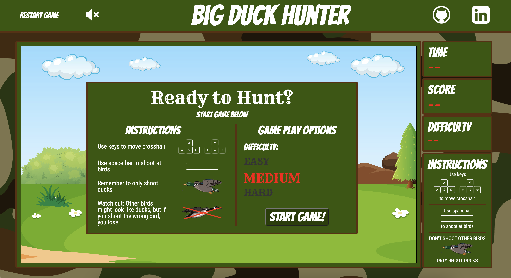
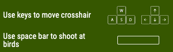

# BigDuckHunter

[Big Duck Hunter](https://stevenpaalz.github.io/BigDuckHunter/) is a browser-based game that allows a user to play as a hunter attempting to shoot ducks. The user, however, does not want to shoot other types of birds. The user controls the displayed cross hair to aim and shoot at ducks. The user is awarded points for each duck they shoot. However, if a user shoots any bird besides a duck, the user loses the game.

The user is given 30 seconds to shoot as many ducks as they can without shooting other birds. The game also features the ability for the user to change the difficulty of the game, which changes the speed and quantity of birds. The user's score and a timer are displayed to the user during gameplay. Additionally, sound effects include background music, gun shot sounds, and duck quacks to signal successful shots.




## Wireframes


## Controls



## Functionality

The gameplay uses canvas to animate the various birds and trees displayed in the canvas area. Birds are generated to have random spawn locations, speeds, and periodic changes in direction. The speed and quantity of birds is dependent on the selected difficulty.
### Bird Generation:
```    
static generateDucks(difficulty, game) {
        let ducks = []
        let numDucks = 15;
        switch(difficulty) {
            case "Medium":
                numDucks = 10;
                break;
            case "Hard":
                numDucks = 5;
                break;
        }
        for (let i = 0; i < numDucks; i ++) {
            ducks.push(new Duck(difficulty, game))
        }
        return ducks;
    }

    static respawn(difficulty, game) {
        let newDuck = new Duck(difficulty, game);
        let i = getRndInteger(0, 2)
        if (i===0) {newDuck.x = (-newDuck.width/2)}
        else {newDuck.x = canvas.width}
        return newDuck;
    }
```

Bird sprites were used plus animation in canvas to give birds the appearance of flying. Additionally, trees were animated in each animation cycle to give the trees the appearance of being in front of birds and serving as obstacles in the game.
### Animation Loop:
```
    animate() {
        if (this.time < 0) {
            if (!this.gameLost) {
                return this.gameOver();
            } else {return;}
        }
        const ctx = canvas.getContext("2d");
        ctx.clearRect(0, 0, canvas.width, canvas.height);
        this.frames += 1;
        for (let i = 0; i < this.ducks.length; i++) {
            this.ducks[i].update();
        }
        for (let i = 0; i < this.otherBirds.length; i++) {
            this.otherBirds[i].update();
        }
        for (let i = 0; i < this.trees.length; i++) {
            this.trees[i].draw();
        }
        this.crosshair.move();
        this.drawShots();
        const scoreDisplay = document.getElementById("score-display");
        scoreDisplay.innerText = this.score.toLocaleString('en-US', {
            minimumIntegerDigits: 2
          });
        requestAnimationFrame(this.animate.bind(this));
    }
```

A time interval is set outside the animation loop to ensure that the game lasts only 30 seconds. The run loop initializes the timer and the animation loop.
### Run Logic: 
```
    run() {
        this.ticker = setInterval(this.tick.bind(this), 1000);
        const ctx = canvas.getContext("2d");
        ctx.clearRect(0, 0, canvas.width, canvas.height);
        this.crosshair = new Crosshair(this);
        const difficultyDisplay = document.getElementById("difficulty-display");
        difficultyDisplay.innerText = this.difficulty;
        this.ducks = Duck.generateDucks(this.difficulty, this);
        this.otherBirds = OtherBird.generateOtherBirds(this.difficulty, this);
        this.trees = Tree.generateTrees();
        document.addEventListener("keydown", this.keyDownHandler);
        document.addEventListener("keyup", this.keyUpHandler);
        this.animate();
    }
```

The user can move the crosshair using the arrow keys. In the animation loop, the crosshair is also drawn. Crosshair movement was achieved using the X,Y coordinate plane and key down event listeners.
### Crosshair: 
```
    draw() {
        const ctx = canvas.getContext("2d");
        if (this.x + (this.width / 2) > canvas.width) {
            this.x = canvas.width - (this.width / 2);
        }
        if (this.x + (this.width / 2) < 0) {
            this.x = -(this.width / 2);
        }
        if (this.y + (this.height / 2) > canvas.height) {
            this.y = canvas.height - (this.height / 2);
        }
        if (this.y + (this.height / 2) < 0) {
            this.y = -(this.height / 2);
        }
        ctx.drawImage(this.img, this.x, this.y, this.width, this.height);
    }

    move() {
        if (this.game.leftPressed) {
            this.x -= 5;
        }
        if (this.game.rightPressed) {
            this.x += 5;
        }
        if (this.game.upPressed) {
            this.y -= 5;
        }
        if (this.game.downPressed) {
            this.y += 5;
        }
        this.draw();
    }
```

A fired shot triggers an audio effect. Then the shot is generated on the screen with a hitbox. Collision detection is used to first determine if the shot hit an obstacle (a tree), then if it hit a losing bird, then finally if it hit a duck.
### Fire Shot Logic:
```
    fire() {
        this.framesRemaining = 20;
        const sound = document.getElementById('sound');
        if (sound.dataset.muted === "false") {
            const gunSound = new Audio();
            gunSound.src = "../BigDuckHunter/assets/gun_shot.mp3";
            gunSound.play();
        }
        this.game.currentShots.push(this);
        if (!this.treeCollisions()) {
            this.otherBirdCollisions();
            if (!this.game.gameLost) {
                this.duckCollisions();
            }
        } else {console.log("tree shot!")}
    }
```

Collision detecton logic was used to determine if a shot hit an object. This logic required a computation of the distance between shapes in the X, Y coordinate plane (distance between a circle and a rectangle or two circles).
### Collision Detection:
```
function detectCollision(circ, rect) {
    let distX = Math.abs(circ.x - rect.x - (rect.width/2));
    let distY = Math.abs(circ.y - rect.y - (rect.height/2));
    if (distX > (rect.w / 2 + circ.r)) {
        return false;
    }
    if (distY > (rect.height / 2 + circ.radius)) {
        return false;
    }

    if (distX <= (rect.width / 2) && distY <= (rect.height / 2)) {
        return true;
    }

    var dx = distX - rect.width / 2;
    var dy = distY - rect.height / 2;
    return (dx * dx + dy * dy <= (circ.radius * circ.radius));
}
```

## Future Functionality
I am in the process of making a two-player mode that allows two users to compete against one another in the game.

## Technologies, Libraries, and APIs

- The Canvas API to render gameplay area
- webpack to bundle and transpile the source JavaScript code
- npm to manage project dependencies

## Implementation Timeline

**Friday Afternoon & Weekend**
Set up project, including getting web pack up and running. Build canvas for gameplay area. Spend time familiarizing self with canvas API. Build classes for board, obstacles, flying birds, ducks, and toucans. Display objects on canvas gameplay area.

**Monday**
Create underlying logic for gameplay. Develop logic for shooting birds, scoring points, time, game over, and losing the game. Include ability to restart game after losing or game ends.

**Tuesday**
Implement user controls. Build instructions page that appears before gameplay can begin. Layout extra features around board including score, timer, difficulty level. Implement variable difficulty level.

**Wendesday**
Ensure good, cohesive styling across all aspects of web page. Add in mutable music feature. Include sound effects for gun shots and duck quacks.

**Thursday**
Deploy to GitHub pages. 
