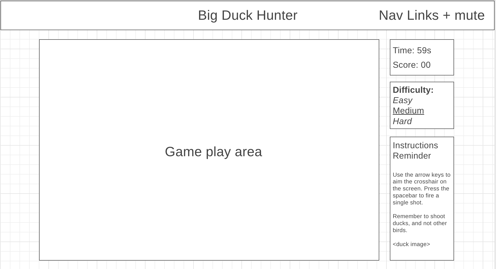

# BigDuckHunter

## Background

The Big Duck Hunter game allows a user to play as a hunter that is attempting to shoot the ducks in a gameplay environment. The user, however, does not want to shoot other types of birds. The user controls the aim of its rifle using the arrow keys to move a crosshair around the gameplay area. Pressing the space bar will fire a shot where the crosshair is currently positioned in the gameplay area. The user will be awarded one point for each duck they shoot. However, if the user shoots any bird besides a duck, they will instantly lose the game. 

The user is given 60 seconds to shoot as many ducks as they can without shooting other birds. The game also features the ability for the user to change the difficulty of the game. The user's score and a timer are displayed ot the user during gameplay.

## Functionality & MVPs

In Big Duck Hunter, users will be able to:

- Start and restart game when the user is ready to play.
- View a gameplay area with flying birds of various types as well as obstacles that birds fly behind.
- Move their crosshair around the gameplay area using the arrow keys to aim at different birds in the game. Users will be able to shoot the different birds in the game with the spacebar. 
- Earn a point by shooting a duck. Shooting any other type of birds will cause the player to immediately lose the game.
- Choose the level of difficulty of the game, which will change the flight speed, number of shootable birds, and number of shootable obstacles present in the gameplay area.
- View a scoreboard and timer that displays the user's score. Running out of time will end the game for the user.

In addition, this project will include:
- Instructions on how to play the game.
- Mutable music and sound effects that will be played during the game.

## Wireframes

## Technologies, Libraries, and APIs

- The Canvas API to render gameplay area
- webpack to bundle and transpile the source JavaScript code
- npm to manage project dependencies

## Implementation Timeline

**Friday Afternoon & Weekend**
Set up project, including getting web pack up and running. Build canvas for gameplay area. Spend time familiarizing self with canvas API. Build classes for board, obstacles, flying birds, ducks, and toucans. Display objects on canvas gameplay area.

**Monday**
Create underlying logic for gameplay. Develop logic for shooting birds, scoring points, time, game over, and losing the game. Include ability to restart game after losing or game ends.

**Tuesday**
Implement user controls. Build instructions page that appears before gameplay can begin. Layout extra features around board including score, timer, difficulty level. Implement variable difficulty level.

**Wendesday**
Ensure good, cohesive styling across all aspects of web page. Add in mutable music feature. If time permits, add in gravity feature for shot birds to fall to ground before disappearing.

**Thursday**
Deploy to GitHub pages. If time, rewrite proposal as a production README.
